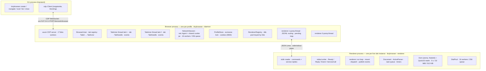
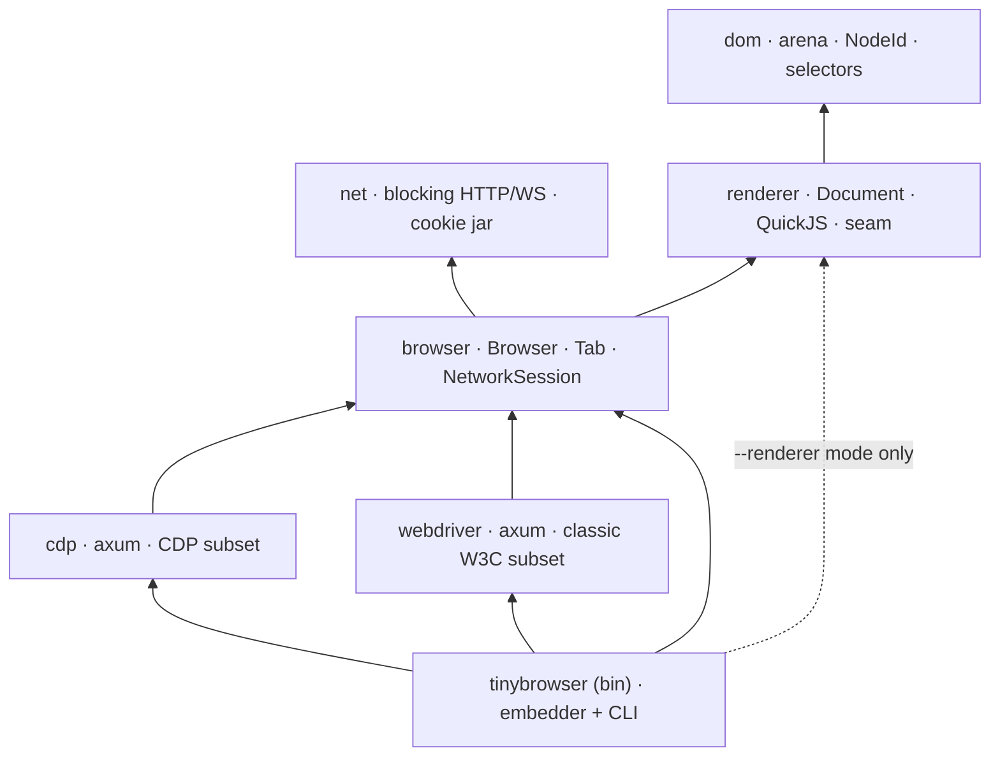
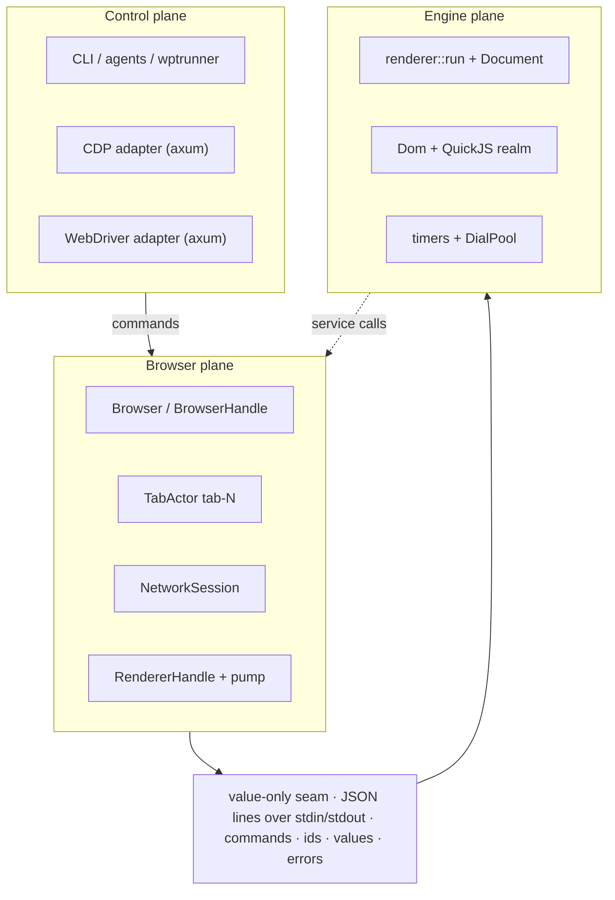
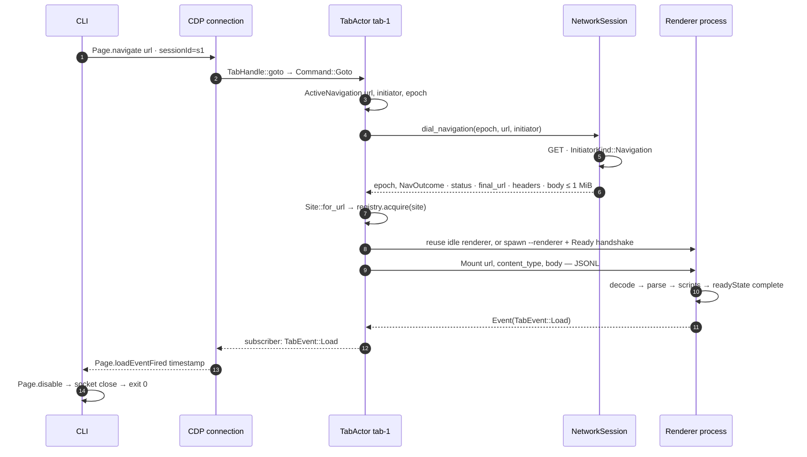
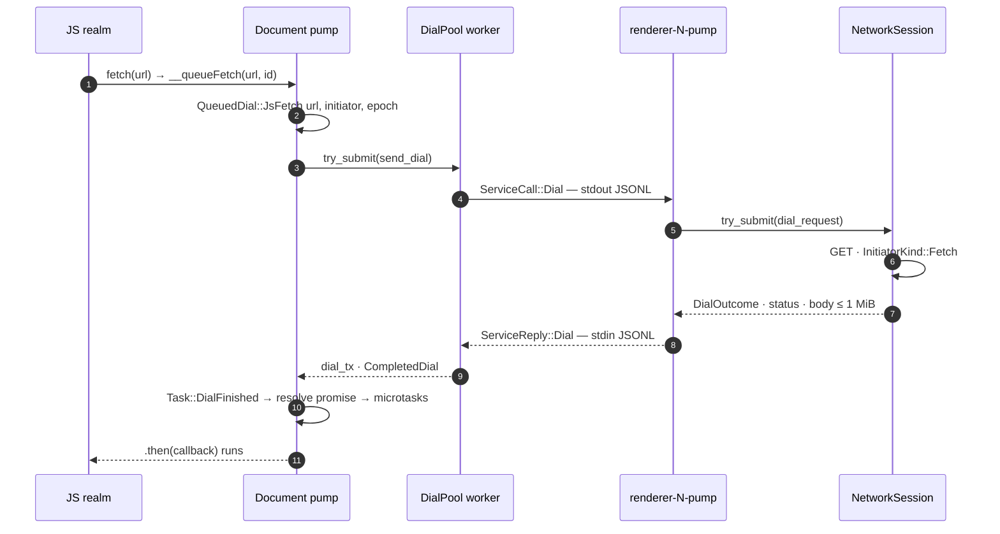
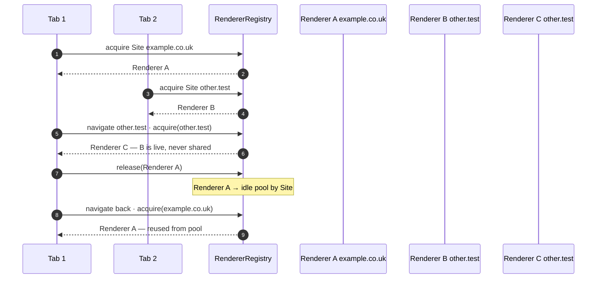

# tinybrowser — architecture, end to end

One executable. A **browser process** that owns profiles, tabs, and the network.
One **renderer process per site instance** that owns the DOM and JavaScript. CDP
and WebDriver are thin adapters on top. Everything below is the current tree:
names, paths, and message shapes match the code in `crates/`.

## The 30-second version

1. **One binary, three modes.** The default mode is a CLI that speaks CDP.
   `--daemon` is the browser process for one named profile (hidden mode).
   `--renderer` is the renderer process (hidden mode).
2. **The CLI auto-starts the browser process.** It looks for
   `$XDG_RUNTIME_DIR/tinybrowser/<profile>/daemon.json`; if the profile has no
   live daemon, it re-spawns the same executable detached as `--daemon`. A
   startup lock elects one daemon when several CLIs race.
3. **CLI ⇄ browser process is CDP over a loopback WebSocket**
   (`ws://127.0.0.1:PORT/devtools/browser`). HTTP discovery lives at `/json`,
   `/json/list`, and `/json/version`. There is also a direct page socket at
   `/devtools/page/{id}`.
4. **“Tab” means the browser-side `Tab` object.** `Target.createTarget` spawns a
   `TabActor` OS thread in the browser process and returns a value-only
   `TabHandle`. It is *not* a process, and not the Document.
5. **Navigating is browser work.** The browser process fetches the top-level
   document through its `NetworkSession`, computes the site (scheme + eTLD+1),
   then mounts the bytes into the renderer process for that site.
6. **The renderer process hosts the page engine.** `Dom` (arena), QuickJS realm,
   active HTML parser, task queue, and timers. It *never links `net`*. JS
   `fetch()` and classic `<script src>` loads ask the browser process over a
   JSON-lines pipe; the browser process does the HTTP.
7. **WebDriver is a second adapter** over the same `BrowserHandle`, used by
   web-platform-tests. `tinybrowser --webdriver=PORT` runs in-process (no
   separate profile daemon) with its own `NetworkSession`.

## Your model, corrected

You wrote: *“cli spawn → fork daemon → we talk through cdp → this spawns a tab →
parent communicates with tab via ipc → parent owns networking stuff → page just
parse html + eval js, need network then contact parent. is that it?”*

That is **about 80% the right skeleton**. The corrections are about *what a tab
is*, *where the process boundary is*, and *who drives navigation*.

| You said | Verdict | What actually happens |
|---|---|---|
| “CLI spawn fork daemon” | fix the word | No `fork()`. The CLI runs `std::process::Command::new(current_exe())` with `--daemon --profile=<name>`, stdio set to `null`, and `process_group(0)`. It then polls for `daemon.json` for up to 5 s. A lock in the runtime directory (create-new `lock` file, PID inside, stale detection) means only one daemon ever wins. *Source: `src/daemon.rs`.* |
| “we talk through CDP” | correct | The CLI is a CDP client (`cdp::Client`, tungstenite) over a loopback WebSocket. So are external agents. WebDriver is a separate peer protocol used by WPT, not the CLI path. |
| “this spawns a tab” | right idea, wrong kind | `Target.createTarget` calls `BrowserHandle::create_tab()`, which spawns a **browser-side thread** named `tab-N` running `actor_loop`, and registers it as `HashMap<TabId, TabActor>`. The returned `TabHandle` is a value-only handle: command sender + request-id counter + shared renderer pointer. No process is created for the tab. |
| “parent communicates with tab via ipc” | no — two different links | Browser process ⇄ tab is **in-process**: ordinary `std::sync::mpsc` channels and reply channels per command. The only real IPC is **browser process ⇄ renderer process**: newline-delimited JSON over the child’s `stdin`/`stdout`. And the renderer is per **site instance**, not per tab. |
| “parent owns networking stuff” | correct | One `NetworkSession` per profile: one shared `net::Agent` (the live cookie jar inside it), a bounded executor of **16 blocking workers with a 256-task queue**, and the `ProfileStore`. Renderer crates take `net` only as a dev-dependency for tests — the renderer path never links it. |
| “page just parse html + eval js; need network then contact parent” | correct, incomplete | The renderer owns `Dom`, QuickJS, the active parser, a task queue, and timers. It contacts the browser process for `fetch()`, classic `<script src>`, and cookie access. Important nuance: the **top-level navigation itself is browser-driven** — the renderer never initiates it, it only receives a `Mount` containing already-fetched bytes. |

::: warn
**The three things missing from your model:**

1. **Site instance isolation.** The process boundary is scheme + registrable
   domain (eTLD+1), not the tab and not the origin. Cross-site navigation swaps
   renderers while `Tab` and `TabId` survive.
2. **Navigation is a browser decision.** `TabHandle::goto` only records intent;
   the `TabActor` loop launches the dial, and the browser process commits the
   result as a `Mount`.
3. **Everything on the seam is values.** Commands, request ids, events, script
   results, errors. No `NodeId`, no QuickJS value, no callback, no `net` type
   ever crosses.
:::

## The cast: processes & threads

At runtime there are up to three kinds of OS process. The key move is that
*nothing* is per-tab at the process level.



**Solid regions are OS processes; inner boxes are threads and owned state.** The
two IPC hops are the CDP WebSocket (CLI ⇄ browser process) and JSONL pipes
(browser process ⇄ renderer process). Browser process ⇄ tab is in-process mpsc.

| Process | Started by | Lives until | Owns |
|---|---|---|---|
| CLI / CDP client | you | one command exits | one WebSocket connection, a blocking CDP client |
| `--daemon` (browser process) | auto-spawned by a CLI command, or manually | `Browser.close`, user-session exit, or failure | `Browser`, tab registry, `NetworkSession`, `ProfileStore`, renderer registry and pumps |
| `--renderer` (renderer process) | the browser process, on first mount for a site | tab close, cross-site navigation, or crash | exactly one `Document`: `Dom`, QuickJS realm, parser, tasks, timers |

### Threads inside the browser process

- Two Tokio worker threads for the axum CDP server (and the same shape for the
  WebDriver server when that mode runs).
- One `tab-N` thread per tab, running `actor_loop`. It is a poll loop: while it
  has background work (navigation in flight, waiters, subscribers) it wakes
  every 10 ms; otherwise it blocks on its command channel and costs nothing.
- One `renderer-N-pump` thread per live renderer, reading JSONL from the child
  and routing replies, events, and service calls.
- The network executor: 16 plain OS threads reading a bounded 256-slot channel.

### Threads inside a renderer process

- Main loop (`renderer::run`): command dispatch, `Document::drive_for`, event
  publication.
- stdin reader and stdout writer.
- DialPool: 16 workers with a 256-slot queue for browser-service calls. (The
  local backend instead runs the same loop on a thread and calls
  `FetchServices` directly.)

## Crate map

Dependencies are the architecture: a `[dependencies]` line is the only wiring,
and the compile-error law is enforced by crate boundaries, not review.



Arrows point at the dependency. `cdp` and `webdriver` are peers: neither may
depend on the other, nor on `dom`, `net`, or `renderer`.

| Crate | Depends on | Charter |
|---|---|---|
| `dom` | — | Generational arena, `NodeId`, selector engine. No parser dependency; pins `markup5ever` names because html5ever does. |
| `net` | — | Blocking HTTP/WS plus the live cookie jar. Public names are ours (`Agent`, `Response`, …); ureq/native-tls/tungstenite appear only at documented conversion points. |
| `renderer` | `dom` | Page engine: `TreeSink`, `Document` + QuickJS, the value-only browser seam. **Never `net`**. |
| `browser` | `net`, `renderer` | Browser side: `Browser`, tab `Tab`, `NetworkSession`, renderer registry and backends. |
| `cdp` | `browser`, `axum` | CDP server and client. Routes everything to `BrowserHandle`/`TabHandle`. |
| `webdriver` | `browser`, `axum` | Classic W3C WebDriver subset; the WPT endpoint. |
| `tinybrowser` | `browser`, `cdp`, `webdriver`, `renderer` | Embedder and binaries. `renderer` is used only to dispatch the hidden `--renderer` mode. |

## Three planes

Think of the system as three stacked planes with one hard membrane between the
bottom two.



The single sentence to memorize:

::: note
**The browser process dials, decides the site, and mounts; the renderer parses,
runs JS, and reports events; the renderer never sees `net`.**
:::

## The value-only seam

The seam is defined in `crates/renderer/src/protocol.rs` and is shared by both
backends (`Renderers::Process` in production, `Renderers::Local` for tests and
`Browser::ephemeral()`). The process backend serializes each message to one JSON
object on one line.

**May cross**

- Commands and their request ids
- `Mount` bytes (the document)
- Script source and `RemoteValue` results
- `TabEvent`s
- Explicit `TabError`s
- Service calls: dials, cookie get/set, mark-dirty

**Never crosses**

- `dom::NodeId` and DOM handles
- QuickJS values, callbacks, promises
- Rust borrows and closures
- `net` types (the renderer cannot name them)

### Message catalog

| Direction | Type | Variants |
|---|---|---|
| browser → renderer | `ToRenderer` | `Request { id, command }`, `ServiceReply { id, reply }` |
| browser → renderer | `Command` | `Mount`, `Eval`, `ExecuteScript { source, timeout_ms }`, `SetDocumentUrl`, `IsIdle`, `Shutdown` |
| renderer → browser | `FromRenderer` | `Ready`, `Reply { id, reply }`, `Event(TabEvent)`, `ServiceCall { id, call }` |
| renderer → browser | `TabEvent` | `Load`, `Timer(u32)`, `Fetch { status }`, `FetchFailed`, `ScriptFailed` |
| renderer → browser | `ServiceCall` | `Dial(DialRequest)`, `CookieGet { url }`, `CookieSet { value, url }`, `MarkDirty` |
| renderer → browser | `DialKind` | `JsFetch`, `ClassicScript` (there is no XHR and no renderer-initiated navigation in v1) |

Shape of the JSONL on the pipe — serde externally-tagged enums:

```text
browser → renderer  {"Request":{"id":7,"command":{"Mount":{"url":"about:blank","content_type":null,"content_language":null,"body":[60,33,100,111,99,116,121,112,101,32,104,116,109,108,62,60,116,105,116,108,101,62,60,47,116,105,116,108,101,62]}}}}
renderer → browser  {"Reply":{"id":7,"reply":{"Unit":{"Ok":null}}}}                     // Mount finished
renderer → browser  {"Event":"Load"}                                                    // readyState complete
renderer → browser  {"ServiceCall":{"id":4,"call":{"Dial":{"kind":"JsFetch","url":"http://example.test/data","initiator":"http://example.test/","read_body":true}}}}
browser → renderer  {"ServiceReply":{"id":4,"reply":{"Dial":{"status":200,"final_url":"http://example.test/data","content_type":"text/plain","content_language":null,"body":[112,97,121,108,111,97,100]}}}}
browser → renderer  {"Request":{"id":8,"command":"Shutdown"}}
```

::: note
**Two body caps bound the worst case:** navigation bodies and renderer fetch
bodies are both capped at 1 MiB. Because `Mount::body` is a `Vec<u8>`, the JSON
representation is an array of numbers, not base64 — a deliberate simplicity
trade for a first slice.
:::

## Browser process lifecycle

`daemon::ensure(profile, data_home)` is the whole trick behind “it just works”.

1. **Check registration.** Read
   `$XDG_RUNTIME_DIR/tinybrowser/<profile>/daemon.json`. If it parses and its PID
   is alive (`/proc/<pid>` exists), return the endpoint.
2. **Spawn detached.** Otherwise run the current executable with
   `--daemon --profile=<name>`, pass `XDG_DATA_HOME` through, set
   stdin/stdout/stderr to null, and put it in its own process group.
3. **Elect one daemon.** The browser process creates the runtime dir 0700 and
   tries `create_new` on `lock`. Whoever wins continues; losers exit 0. Stale
   locks are detected by unreadable/empty/bad PID content older than 2 s, or a
   dead PID.
4. **Bind and register.** Bind `127.0.0.1:0` (random port), then atomically write
   `daemon.json` with `{pid, host, port}`, mode 0600.
5. **Open the profile.** `Browser::open_in(data_home, profile)` →
   `ProfileStore::open_in` takes an exclusive OS lock on
   `profiles/<name>/lock`. A second writer fails explicitly.
6. **Serve CDP.** `cdp::serve(listener, &browser.handle())` runs axum on a
   2-worker Tokio runtime until `Browser.close` flips a watch channel.
7. **Stay alive.** There is no idle timeout: agents that pause keep their tabs
   and cookies.

Important paths:

```text
$XDG_RUNTIME_DIR/tinybrowser/<profile>/daemon.json     # {pid, host, port}, mode 0600
$XDG_RUNTIME_DIR/tinybrowser/<profile>/lock           # daemon election, PID text
$XDG_RUNTIME_DIR/tinybrowser/<profile>/selected       # CLI convenience: last selected target
$XDG_DATA_HOME/tinybrowser/profiles/<profile>/lock     # exclusive profile owner lock
$XDG_DATA_HOME/tinybrowser/profiles/<profile>/cookies  # versioned text, mode 0600
```

## Flow A: the CLI

```sh
$ tinybrowser create
1
$ tinybrowser list
1	about:blank
$ tinybrowser navigate https://example.com/
$ tinybrowser eval "document.getElementsByTagName('h1')[0].firstChild.data"
"Example Domain"
$ tinybrowser eval "1+2"
3.0
$ tinybrowser close
$ tinybrowser list        # empty
```

What each command does:

- `create [url]` → CDP `Target.createTarget`. In the browser process:
  `create_tab()` spawns the `tab-1` thread. `about:blank` is mounted immediately
  via `load_html("<!doctype html><title></title>")`, which acquires a renderer
  under an opaque per-tab site key. The target id is written to the `selected`
  file and printed.
- `list` → `Target.getTargets`. For each `TabId` the adapter asks the tab for its
  current document URL.
- `select ID` → no CDP call; it just writes the runtime `selected` file.
- `navigate URL` → attach flattened, `Page.enable`, `Page.navigate`, then block
  reading events until `Page.loadEventFired` (30 s CLI deadline), then
  `Page.disable`.
- `eval SCRIPT` → attach flattened, `Runtime.evaluate`, print the preview value;
  `exceptionDetails.text` becomes a CLI error.
- `close [id]` → `Target.closeTarget`; then fix up the `selected` file to another
  live target or clear it.

The actual CDP frames for “navigate” (one connection, flattened session `s1`):

```text
→ {"id":1,"method":"Target.attachToTarget","params":{"targetId":"1","flatten":true}}
← {"id":1,"result":{"sessionId":"s1"}}
→ {"id":2,"method":"Page.enable","params":{},"sessionId":"s1"}
← {"id":2,"result":{},"sessionId":"s1"}
→ {"id":3,"method":"Page.navigate","params":{"url":"https://example.com/"},"sessionId":"s1"}
← {"id":3,"result":{"frameId":"1"},"sessionId":"s1"}          # queued, not finished
← {"method":"Page.loadEventFired","params":{"timestamp":0.31},"sessionId":"s1"}
→ {"id":4,"method":"Page.disable","params":{},"sessionId":"s1"}
```



Steps 5–6 happen on a network worker; step 8 happens back on the tab thread when
it polls the dial channel. For `create` with `about:blank`, steps 5–9 are
replaced by an immediate `load_html` mount.

## Flow B: raw CDP + the embedder API

Any CDP client works. Discovery is plain HTTP:

```sh
$ curl -s http://127.0.0.1:PORT/json/version
{"Browser":"tinybrowser/0.1.0","Protocol-Version":"1.3","webSocketDebuggerUrl":"ws://127.0.0.1:PORT/devtools/browser"}

$ curl -s http://127.0.0.1:PORT/json
[{"id":"1","type":"page","url":"about:blank","webSocketDebuggerUrl":"ws://127.0.0.1:PORT/devtools/page/1"}]
```

::: note
**Naming:** on the CDP wire this object is a *page target* — type `"page"`,
addressed with the `Page.*` domain. Our host object is a `Tab`. CDP’s
experimental *tab target* (`Target.createTarget {forTab:true}`) is the browser-UI
container, a different object that we do not model. The adapter translates:
`Page.navigate` → `TabHandle::goto`, and so on.
:::

Two ways to attach:

- **Browser socket + flattened sessions.** Connect to `/devtools/browser`,
  `Target.attachToTarget {targetId, flatten:true}`, then put the returned
  `sessionId` at the top level of later messages. Events come back with the same
  `sessionId`. This is what the CLI does.
- **Direct page socket.** Connect to `/devtools/page/<id>`. No session id is
  needed; both routes reach the same `TabHandle`.

### Implemented CDP surface (honest subset)

| Level | Method | Effect |
|---|---|---|
| browser | `Browser.getVersion` | constant: product, protocol 1.3, QuickJS as `jsVersion` |
| browser | `Browser.close` | `BrowserHandle::close()`; shuts the server down |
| browser | `Target.getTargets` | `BrowserHandle::tabs()` + each tab's document URL |
| browser | `Target.createTarget` | `create_tab()`, then `load_html` for blank or `goto` |
| browser | `Target.closeTarget` | `BrowserHandle::close_tab()` |
| browser | `Target.attachToTarget` | requires `flatten:true`; registers a session id |
| browser | `Target.detachFromTarget` | drops the session and its subscriptions |
| session/page | `Page.enable` / `Page.disable` | subscribe/unsubscribe to `Page.loadEventFired` |
| session/page | `Page.navigate` | `TabHandle::goto` (blank → `load_html`); replies immediately with `frameId` |
| session/page | `Runtime.evaluate` | `TabHandle::execute_script`, preview-shaped |
| session/page | `Runtime.enable` / `Runtime.disable` | no-ops |
| anything else | — | `-32601 "'X.y' wasn't found"` |

Errors are JSON-RPC shaped:
`{"id":3,"error":{"code":-32601,"message":"'Foo.bar' wasn't found"}}`. The
adapter only forwards `TabEvent::Load` as `Page.loadEventFired`; the other
`TabEvent` variants exist for the Rust API but are not published over CDP yet.

### Embedder path: no CDP, no profile daemon

The root crate exposes the browser side directly. `Browser::ephemeral()` uses
`Renderers::Local` (renderer work on a thread, no memory isolation) and an
in-memory profile. Production `Browser::open_in` uses `Renderers::Process`.

```rust
use tinybrowser::Browser;

fn main() -> Result<(), Box<dyn std::error::Error>> {
    let browser = Browser::ephemeral()?;
    let tab = browser.handle().create_tab()?;        // TabHandle
    tab.load_html("<!doctype html><p>tab probe</p>")?;
    if let Some(url) = std::env::args().nth(1) {
        tab.goto(&url)?;                             // record intent…
        tab.run_until_load()?;                       // …drive the actor until Load
    }
    tab.eval("setTimeout(() => { globalThis.result = 42; }, 0)")?;
    tab.run()?;                                      // wait until idle
    println!("{}", tab.eval("globalThis.result")?);
    Ok(())
}
```

The `TabHandle` methods that exist today:

```text
load_html(&str)                    goto(&str)                       eval(&str) -> String
execute_script(&str) -> RemoteValue  execute_script_timeout(..., Option<Duration>)
run()                                run_until_load()                 run_until_load_timeout(Duration) -> bool
run_until_js_true(&str, Duration) -> bool
document_url()                       content_language()               document_cookie() / set_document_cookie(...)
events()                             subscribe() -> Receiver<TabEvent>  last_navigation_failed()
shutdown()
```

## Flow C: WebDriver / WPT

`tinybrowser --webdriver=PORT` is the in-process WPT endpoint. It builds its own
`ProfileStore` + `NetworkSession` + `Browser` in the root process — no separate
profile daemon — and serves classic W3C WebDriver with **one active session**.

A session, end to end:

```sh
$ tinybrowser --webdriver=9515 &

$ curl -s -X POST localhost:9515/session -d '{}'
{"value":{"sessionId":"s1","capabilities":{"browserName":"tinybrowser"}}}

$ curl -s -X POST localhost:9515/session/s1/url -d '{"url":"http://127.0.0.1:8000/page"}'
{"value":null}                                  # returns after Load, or 500 "timeout"

$ curl -s -X POST localhost:9515/session/s1/execute/sync \
    -d '{"script":"return 1+1","args":[]}'
{"value":2.0}

$ curl -s -X DELETE localhost:9515/session/s1
{"value":null}                                  # detaches automation; tabs stay alive
```

| Endpoint | Maps to |
|---|---|
| `GET /status` | `{"ready":true}` |
| `POST /session` | one-session gate; creates a blank tab and window `w1` |
| `DELETE /session/{id}` | drops the automation session only |
| `POST /session/{id}/url` | `goto`, then `run_until_load_timeout` (default 300 s) |
| `GET /session/{id}/url` | `TabHandle::document_url()` |
| `POST /session/{id}/execute/sync|async` | `execute_script_timeout` wrapped in a helper script; async awaits a completion flag (default 30 s) |
| `GET/POST /session/{id}/window`, `/window/handles`, `/window/new` | select/create windows (`wN`) over tabs |
| `DELETE /session/{id}/window` | `close_tab`; closes the session if it was the last window |
| `GET/POST window/rect` | static 800×600 |
| `POST/GET /session/{id}/timeouts` | script and pageLoad only; implicit is always 0 |
| click / actions | `500 "unsupported operation"` |
| anything else | `404 "unknown command"` |

Every WebDriver request is dispatched inside one `spawn_blocking` with the
session table locked, so the requests serialize. The adapter owns only
automation state: current window, timeouts, element-reference encoding. It does
not own tabs, cookies, or the browser.

WPT context: `./tools/wpt/run` builds the binary and runs `wpt run` with
`--binary`, `--ssl-type none`, and `--resolve=*.test=127.0.0.1`. Each endpoint
gets a fresh temporary `XDG_RUNTIME_DIR`/`XDG_DATA_HOME` so no test leaks
cookies into another.

## Navigation deep dive

### Browser side: intent → dial → site → mount

1. `TabHandle::goto(spec)` sends `Command::Goto`. `Tab::goto` resolves the URL
   (absolute or joined against the current document URL; only
   `http`/`https`), bumps `nav_epoch`, and stores
   `ActiveNavigation { url, initiator, epoch, submitted: false }`. It returns
   immediately.
2. Each turn of `actor_loop` calls `launch_navigation()`, which submits
   `FetchHandle::dial_navigation(epoch, url, initiator, dial_tx)` to the network
   executor (non-blocking `try_submit`; full queue means the navigation fails,
   never that the tab thread blocks).
3. A worker runs `net::Agent::request(GET, url).with_initiator_kind(InitiatorKind::Navigation).with_initiator(document_url)`,
   reads status, `final_url`, `Content-Type`, `Content-Language`, and the body
   up to 1 MiB, then sends `(epoch, NavOutcome)` back through the dial channel.
4. `pump_navigation()` discards results whose epoch is stale, then calls
   `commit_navigation()`: `Site::for_url(final_url)`, `document_url` /
   `content_language` updated, `Mount` built.
5. `Tab::mount()` acquires the renderer for that site and sends
   `RendererCommand::Mount`. If the acquire fails, the renderer is dropped — a
   dead renderer is never reused.

::: note
**Why browser-driven?** The response headers decide the site, and the site
decides the process. Only the browser process can make that call. It also means
a renderer never holds a socket: the process boundary is the security boundary,
and the network is outside it.
:::

### Renderer side: mount → parse → scripts → load

1. `Document::mount()` resets the JS realm (new QuickJS realm; drops the old
   one), decodes the bytes — BOM → HTTP charset → 1024-byte `<meta charset>`
   prescan → Windows-1252 fallback — and starts the active parser.
2. The renderer drives html5ever *incrementally*. `advance()` returns
   `ParseProgress::Script(handle)` when it reaches a parser-blocking script.
3. **Inline script:** the tree is taken out of the parser (`take_state`),
   evaluated in QuickJS against the partial DOM, DOM mutations are applied, and
   any `document.write()` input is pushed to the front of the tokenizer
   (`insert_html`), then the tree is restored and parsing resumes. This is what
   makes `document.write` and script-visible partial DOM work.
4. **Classic `<script src>`:** the parser suspends
   (`classic_fetch_in_flight`), a `ClassicScript` dial goes to the browser
   process, and the body is evaluated when it comes back; parsing then resumes.
5. On `Done`, `fire_document_load()` flips `document.readyState` to
   `"complete"`, pushes `TabEvent::Load`, and dispatches the JS `load` event.

### The renderer’s task queue

Parsing and inline scripts are not queued; they run while the parser advances.
The queue itself carries exactly three task kinds:

```rust
enum Task {
    Timer(u32),                  // a timer deadline elapsed
    DialFinished(CompletedDial), // fetch / classic script body arrived
    DialFailed(DialFail),        // transport, timeout, or body limit
}
```

Each completed task runs to completion and then drains QuickJS microtasks
(`execute_pending_job` until false). Timers are stored by the browser process,
not by QuickJS: our `setTimeout` records a function and a deadline and wakes the
loop.

## Dials: fetch & classic scripts

This is the “renderer needs network → asks the browser process” part, in full.



One JS `fetch()`, end to end. The renderer checks its `epoch` and stop flag at
both ends, so a navigation can invalidate an in-flight dial. The `ServiceCall`
and `ServiceReply` steps are the pipe; with `Renderers::Local` they collapse
into an in-process mpsc call.

**Process backend:** `PipeServices::call` allocates a service-call id, writes
`FromRenderer::ServiceCall` to stdout, and blocks the dial worker on a per-id
reply channel until the browser process writes `ToRenderer::ServiceReply` to the
child’s stdin. The renderer pump thread offloads the dial to the network
executor, so the pump itself never blocks on HTTP.

**Local backend (tests, `ephemeral()`):** the renderer gets `FetchServices`
directly. Its `dial()` submits to the same network executor and waits on an mpsc
reply. No pipe, no process, same value types.

**Cookies** ride the same rail: `document.cookie` getter →
`ServiceCall::CookieGet` → `FetchHandle::cookies_for`; setter → `CookieSet` +
`MarkDirty`. Response `Set-Cookie` lines are stored inside `net` during the
request itself, before redirects are followed.

## Cookies & the profile

- **One live jar per browser process.** `net::Agent` holds
  `Arc<Mutex<CookieJar>>`; cloning an agent clones the arc. Every
  `FetchHandle`, every tab, and every renderer dial shares it.
- **One durable owner.** `ProfileStore` is not a second jar: it loads the cookie
  file into the agent on open and saves the agent’s persistent cookies on
  `Browser.close` when a dirty flag is set.
- **Exclusive.** Opening a profile takes an OS file lock; a second writer fails
  explicitly. Mode 0600 on files, 0700 on directories.
- **Crash-safe writes.** Same-directory temp file → `fsync` → atomic rename →
  directory `fsync`.
- **Corruption policy.** Unparsable cookie data is renamed to
  `cookies.corrupt.<millis>` and the profile starts with an empty jar; other I/O
  errors propagate.
- **Session cookies** are not persisted; only cookies with an expiry are
  exported.

Cookie semantics live in `net`: host-only vs Domain, path matching, secure rules
(`localhost` and loopback are treated as secure), `__Secure-`/`__Host-`
prefixes, per-domain and global caps, oldest-use eviction, and the SameSite
decision — where `InitiatorKind::Navigation` is the Lax top-level exception. The
public suffix list is embedded; it also powers site identity via
`net::site(url)`.

## Site isolation

**Site = scheme + registrable domain (eTLD+1).** Not the tab. Not the origin.
Ports do not participate. This is Chromium’s definition, chosen because cookies
and `document.domain` agree with it, and because same-site frames must
eventually share a heap while cross-site frames must not.



- **Cross-site navigation wipes the realm.** A test navigates `localhost` →
  `127.0.0.1` (different sites) and pins that a `globalThis` property is gone.
- **Opaque keys are never pooled.** `about:blank` and other non-http(s)
  documents get `opaque:tab-N`, so one tab’s blank document cannot leak into
  another.
- **Crash containment.** A renderer crash loses that document only. The
  browser-side pump clears the pending-request map, so blocked callers wake as
  `ActorStopped` instead of hanging; the browser process and other tabs survive.
- **Sandboxing is later.** Address spaces and value-only IPC are the v1
  properties; seccomp and namespaces are a later security phase.

## Scheduling & limits

| Limit | Value | Where |
|---|---|---|
| QuickJS execution budget | 5 s default; per-protocol deadline may shorten | `renderer/src/js/mod.rs` |
| QuickJS heap / stack | 32 MiB / 512 KiB per realm | `renderer/src/js/mod.rs` |
| Interrupt | stop-aware interrupt handler checked during execution | `with_budget` |
| Renderer request timeout | 60 s per browser→renderer request | `browser/src/link.rs` |
| Renderer handshake | 5 s for `Ready` | `browser/src/link.rs` |
| Network executor | 16 workers · 256-task bounded queue · `try_submit` | `browser/src/network.rs` |
| Renderer DialPool | 16 workers · 256-task bounded queue | `renderer/src/document/mod.rs` |
| Navigation body | 1 MiB | `browser/src/network.rs` |
| Fetch body | 1 MiB | `renderer/src/document/dial.rs` |
| Page fetch timeout | 30 s per call | `NetworkSession::from_builder` |
| Tab loop tick | 10 ms while busy | `TabActor` |
| CDP event poll | 20 ms | `cdp/src/lib.rs` |
| Binary ceiling | 10 MB stripped x86_64 | ADR 0012 |

**Backpressure is failure, not blocking.** Every submit path is
`try_send`/`try_submit`: when a queue is full, a navigation is recorded as
failed and a renderer dial returns `None`. No tab thread or renderer thread ever
parks on a full network queue.

**Cancellation is layered:** navigation results are tagged with `nav_epoch` and
stale results are discarded; renderer dials carry a JS epoch and check the
shared stop flag; closing a tab interrupts the renderer (the local backend flips
the stop flag, the process backend kills the child), and later completions are
rejected.

Verify it yourself:

```sh
cargo run --example tab_probe                       # embedder path, in-process renderers
cargo test -p browser                                # actor, links, profile
cargo test -p cdp                                    # CDP routing and flatten
cargo test -p webdriver                              # one-session WebDriver
./tools/wpt/run                                      # web-platform-tests gate
cargo build --release && stat -c%s target/release/tinybrowser   # sanity-check size
```

## Where the code lives

| Concept | File | What it does |
|---|---|---|
| CLI + modes | `src/main.rs` | clap definitions, mode dispatch, `--webdriver` mode |
| CLI commands | `src/cli.rs` | CDP client calls for create/list/select/eval/navigate/close |
| Browser process (daemon) | `src/daemon.rs` | spawn, lock election, registration, selected-target file |
| Browser | `crates/browser/src/browser.rs` | `Browser`, `BrowserHandle`, tab registry, close/persist |
| Tab actor | `crates/browser/src/actor.rs` | `Tab`, `TabActor`, `TabHandle`, waits, navigation state |
| Renderer link | `crates/browser/src/link.rs` | registry, `RendererHandle`, local/process spawn, JSONL routing |
| Network session | `crates/browser/src/network.rs` | `NetworkSession`, `FetchHandle`, executor, `ProfileStore` |
| Site key | `crates/browser/src/site.rs` | `Site::for_url` / opaque keys |
| Seam types | `crates/renderer/src/protocol.rs` | commands, replies, events, service calls, errors |
| Renderer loop | `crates/renderer/src/lib.rs` | `run`, command dispatch, event publishing, `TreeSink` |
| Renderer child | `crates/renderer/src/process.rs` | stdio JSONL, `Ready`, `PipeServices` |
| Document | `crates/renderer/src/document/mod.rs` | mount, realm reset, parser driving, tasks, dials |
| Task pump | `crates/renderer/src/document/pump.rs` | task queue, timers, Tokio current-thread waiter |
| Dial shaping | `crates/renderer/src/document/dial.rs` | decode, `send_dial`, body limits |
| JS realm | `crates/renderer/src/js/mod.rs` | QuickJS setup, budgets, fetch/timer shims, value decoding |
| DOM bindings | `crates/renderer/src/js/bindings.rs` | Node/Element/Document/NodeList platform objects |
| Arena + selectors | `crates/dom/src/arena.rs`, `select.rs` | slots/generations, insertion rules, Servo selector engine |
| net hard seam | `crates/net/src/client.rs`, `transport.rs` | `Agent`/`RequestBuilder`; backend conversion points |
| CDP adapter | `crates/cdp/src/lib.rs` | axum router, dispatch tables, flattened sessions, client |
| WebDriver adapter | `crates/webdriver/src/lib.rs` | W3C subset, one session, element encoding |
| Real E2E tests | `tests/cli.rs` | browser-process autostart, renderer children, scripts + fetch over the pipe |

## ADR index

| ADR | Decision |
|---|---|
| [0002](adrs/0002-dom-layer-architecture.md) | DOM layer: arena design, `NodeId`, selector stack. |
| [0005](adrs/0005-html5lib-tree-construction-suite.md) | html5lib-tests as the parser conformance gate. |
| [0006](adrs/0006-net-transport.md) | Transport: ureq + native-tls + tungstenite behind our public types. |
| [0007](adrs/0007-engine-charter.md) | Crate graph, Tokio `rt`+`time` only, no `unsafe`, size discipline. |
| [0008](adrs/0008-wpt-via-webdriver.md) | WPT is driven through classic WebDriver, with temporary profiles. |
| [0009](adrs/0009-named-profile-daemon.md) | One browser process per named profile; CDP as the control plane; local trust model. |
| [0010](adrs/0010-page-actor-ownership.md) | Autonomous tab actors; browser-owned network and profile. |
| [0011](adrs/0011-renderer-processes-per-site.md) | One renderer process per site instance; value-only IPC; browser-driven navigation. |
| [0012](adrs/0012-host-protocol-and-cli-stack.md) | axum + clap for the browser-process layer; 10 MB stripped ceiling. |
| [0013](adrs/0013-vocabulary-and-process-names.md) | Vocabulary: browser process / renderer process / tab; `Page*` renamed to `Tab*`. |

## Glossary

| Term | Meaning |
|---|---|
| Tab | A top-level browsing context (a tab), owned by the browser process. Keeps its identity across navigation; other threads talk to it through `TabHandle`. On the CDP wire it is a *page target* (`"type":"page"`, `Page.*`); CDP’s experimental *tab target* is the browser-UI container and is not modeled. Chromium calls the object a `WebContents`; Gecko’s UI calls it a tab. |
| Document | The active document of a Tab: `Dom`, QuickJS realm, active parser, tasks, and timers. Lives in the renderer process; navigation replaces it. |
| TabHandle | The value-only handle protocols use to talk to one Tab: commands, events, request ids, values, errors. No DOM refs or JS values. |
| TabActor | The browser-side thread coordinating one Tab: identity, navigation dials, waiters, renderer link. Owns no DOM and no JS. |
| Page engine | The code and runtime owning a Document: HTML parser, `Dom`, QuickJS realm, task queue, timers. It is the `renderer` crate. |
| Renderer process | The OS process hosting the page engine: one per live site instance, spawned as `--renderer`. Chromium’s name; Gecko calls it the content process. |
| RendererHandle | The browser process’s value-only handle to one renderer process: request ids, replies, events. |
| Site | Scheme plus registrable domain (eTLD+1). Subdomains share a site; ports do not split it. |
| Site instance | A site within one browsing context group: the isolation unit and the renderer registry key. |
| Browser process | The process-side half: `Browser`, tab registry, `NetworkSession`, renderer registry, protocol adapters. Started as `--daemon` or `--webdriver`. |
| Browser / BrowserHandle | The engine instance for one profile and the value-only handle CDP and WebDriver use to drive it. |
| Profile / ProfileStore | A named durable data set and its exclusively locked on-disk backing (cookies first). |
| NetworkSession | The browser-owned live networking service: one shared `net::Agent`, a 16-worker blocking executor, a 256-task queue. Renderers submit through the seam. |
| Task | One unit of work the HTML event loop orders: parse, run a script, fire a timer, deliver a fetch callback. Our queue on the renderer thread, not Tokio’s future list. |
| Timer | A JS function plus deadline stored by our `setTimeout`; QuickJS does not own it. |
| Initiator kind | Which initiator owns a request: `Navigation`, `Fetch`, `Xhr`, `WsHandshake`. SameSite uses it for the Lax top-level exception. |
| Platform object | A page-JS object implemented in Rust behind a WebIDL interface, wrapping a `NodeId` or tab-owned handle. |
| Hard seam | The `net` public type surface: every public name is ours, so a transport swap cannot leak ureq/tungstenite into `browser`. |
| IPC seam | The value-only message boundary between browser process and renderer process; JSON lines on a pipe for the process backend, the same messages over channels in-process. |
| Flattened session | CDP routing on the browser WebSocket: `Target.attachToTarget` with `flatten:true` returns a `sessionId` carried at the top JSON level. Both it and direct page sockets reach the same `TabHandle`. |
